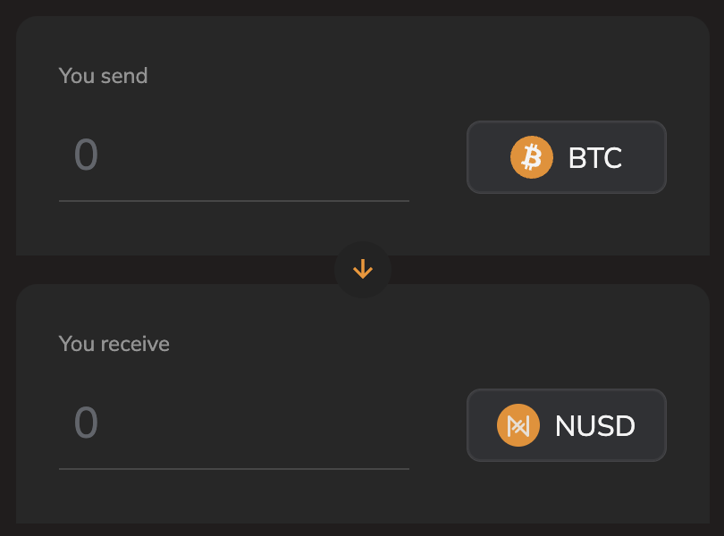

# BAMK•OF•NAKAMOTO•DOLLAR

<figure><figcaption></figcaption></figure>

The Runes ticker [BAMK•OF•NAKAMOTO•DOLLAR](https://magiceden.io/runes/BAMK%E2%80%A2OF%E2%80%A2NAKAMOTO%E2%80%A2DOLLAR) was etched on April 21st 2024 with a max supply of 21,000,000,000 (21 billion)

1,311,625,000 (6.25%) of the supply was offered as a public free mint to degens paying attention. It took \~6 days and around $150,000 in miner fees to mint out.&#x20;

## BAMK Season 1 Incentives

An additional 1,311,625,000 (6.25%) of the supply has been offered as incentives to all NUSD holders. **Simply buy NUSD and hold in your wallet to begin accruing BAMK tokens.** Every block between 844,492 and 886,454 - a total of 41,962 blocks will accrue 31,250 BAMK per block, distributed pro-rata to your NUSD holdings divided by the total NUSD TVL at that block height.

A dashboard to show BAMK accrued per address is in the works.

> Allocation: 31,250 BAMK per block, pro-rata, user\_holdings/NUSD\_TVL \
> Duration: 41,962 blocks (\~291 days) \
> Start block: 844,492\* \
> End block: 886,454 \
> Vesting: 31,250 BAMK per block after block 886,454, for the next 41,962 blocks

_\*Block 844,492 was when the first purchase of NUSD occurred_

## Example:

At block 846,324, Alice buys 5,000 NUSD. At this block height, the current TVL is $704,900 NUSD. So her pro-rata share is 5,000/704,900 = 0.709%

This means for every block she holds her 5,000 NUSD, her address will accrue 0.709%\*31,250 = 221 BAMK tokens.

The APY figure shown on [https://www.bamk.fi/](https://www.bamk.fi/) is calculated by using the current BAMK token price - the amount will fluctuate depending on current NUSD TVL and current BAMK price.

<figure><figcaption></figcaption></figure>

<figure><figcaption>
NUSD TVL growth
</figcaption></figure>

