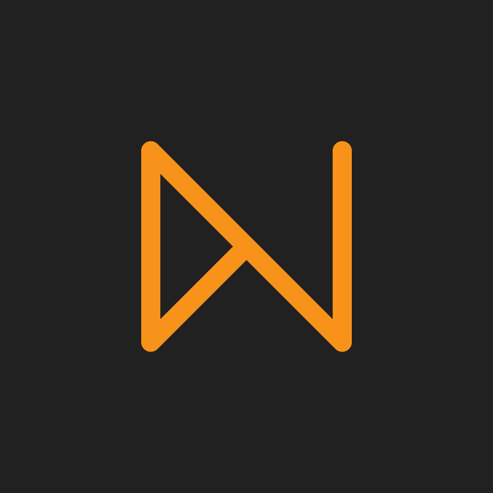

# BAMK•OF•NAKAMOTO•DOLLAR

The Runes token [BAMK•OF•NAKAMOTO•DOLLAR](https://magiceden.io/runes/BAMK%E2%80%A2OF%E2%80%A2NAKAMOTO%E2%80%A2DOLLAR) was etched on April 21st 2024 with a max supply of 21,000,000,000 (21 billion)

<figure><figcaption>
BAMK
</figcaption></figure>

## Tokenomics

1,311,625,000 (6.25%) of the supply was offered as a public free mint to degens paying attention. It took \~6 days and around $150,000 in miner fees to mint out.&#x20;

1,311,625,000 (6.25%) is allocated pro-rata to [Season 1 NUSD Holders](https://app.gitbook.com/o/lfo0cE7iXE4350nipACw/s/L5vd9Yc2g4BdL74C5OqN/\~/changes/91/rewards/season-1-nusd-holders). Earn your share of 31,250 BAMK per block by simply holding NUSD in your wallet.

5,000 BAMK per block is allocated to [LP providers](https://app.gitbook.com/o/lfo0cE7iXE4350nipACw/s/L5vd9Yc2g4BdL74C5OqN/\~/changes/91/rewards/rewards-for-nusd-lp-providers) in the DotSwap NUSD/BTC pool.

1,311,625,000 (6.25%) is allocated to the Foundation, unlocking on the same schedule as Season 1 NUSD Holders. More details on the Foundation coming soon.

The remainder of the supply is currently Unallocated.

## How to buy BAMK?

You can buy BAMK on the following Runes marketplaces:

* Dotswap
  * [BTC/BAMK](https://www.dotswap.app/swap#R\_BTC\_BAMK%E2%80%A2OF%E2%80%A2NAKAMOTO%E2%80%A2DOLLAR)
  * [NUSD/BAMK](https://www.dotswap.app/swap#R\_NUSD%E2%80%A2NUSD%E2%80%A2NUSD%E2%80%A2NUSD\_BAMK%E2%80%A2OF%E2%80%A2NAKAMOTO%E2%80%A2DOLLAR)
* [OKX](https://www.okx.com/web3/marketplace/runes/token/BAMK%E2%80%A2OF%E2%80%A2NAKAMOTO%E2%80%A2DOLLAR/840256:35)
* [MagicEden](https://magiceden.io/runes/BAMK%E2%80%A2OF%E2%80%A2NAKAMOTO%E2%80%A2DOLLAR)
* [UniSat](https://unisat.io/runes/market?tick=BAMK%E2%80%A2OF%E2%80%A2NAKAMOTO%E2%80%A2DOLLAR)
